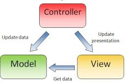
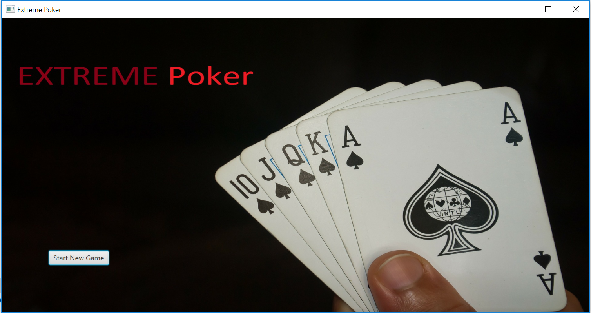
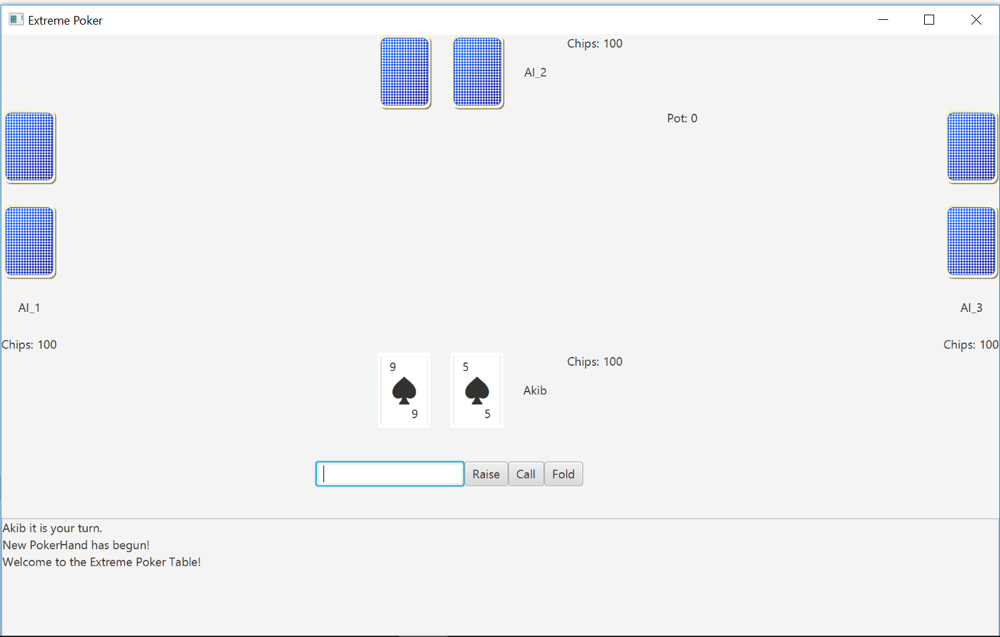
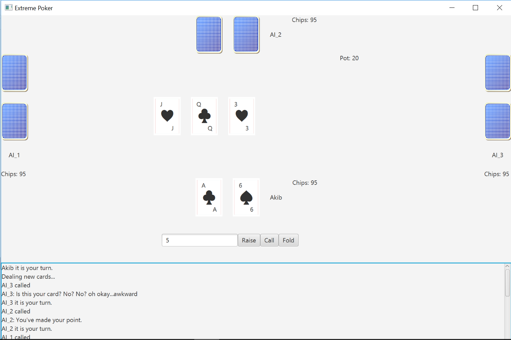
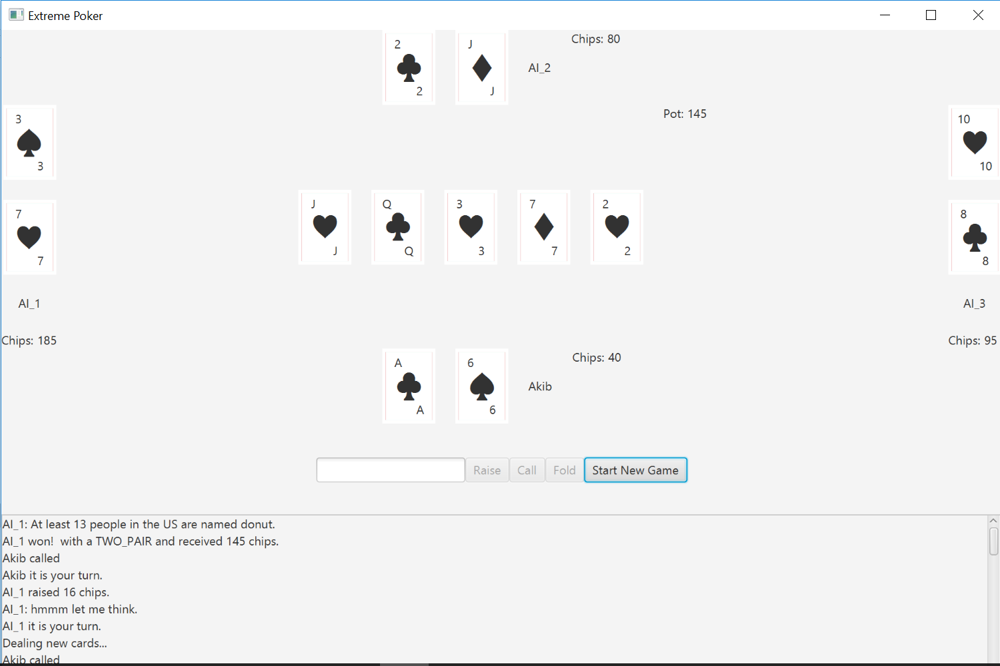

# Poker-Game
A Game of Poker

# Background
The rules for EXTREME Poker are very similar to Texas Holdem and are as follows:

## Game Flow
1. Two Cards are dealt to each player.
2. A betting round ensues.
    * In a betting round each player, in order, is given the option to Raise, Call, or Fold
    * A raise happens when the player adds more chips to the pot than the previous player.
    * A call happens when the player adds the same amount of chips to the pot as the previous player.
    * A fold happens when a player decides they don’t want to continue adding chips and so they quit for that round (forfeiting any           chips they have already bet).
    * A player may not raise by more chips than any other player has bet.
    * A betting round ends once every player has called or folded except for the last player that raised.
3. After the first betting round three cards are put down on the middle of the table which any player can use to build their poker hand.
4. Then another betting round happens.
5. Next, one more card is added to the middle of the table which any player can use to build their poker hand.
6. Another betting round.
7. The final card is dealt to the middle of the table.
8. The final betting round occurs.
9. All Cards are revealed and the winner receives the pot or the pot is split amongst winners.
10. The cards are cleared from the table and we go back to step 1.

## Determining the winner
The winner(s) is/are the player(s) with the best poker hand. A poker hand is made by combining 5 cards. These cards can come from the Player’s two cards or from the Cards on the board. Not from other Player’s cards. If two players have the same poker hand, then they tie.

The types of poker hands are (in order from best to worst):

  * ROYAL FLUSH - A straight from a ten to an ace with all five cards of the same suit.
  * STRAIGHT FLUSH - Any straight with all five cards of the same suit.
  * FOUR OF A KIND - Any four cards of the same rank.
  * FULL HOUSE - Any three cards of the same rank together with any two cards of the same rank.
  * FLUSH - Any five cards of the same suit (not consecutive).
  * STRAIGHT - Any five consecutive cards of different suits. Aces can count as either a high or a low card.
  * THREE OF A KIND - Any three cards of the same rank.
  * TWO PAIR - Any two cards of the same rank together with another two cards of the same rank.
  * PAIR - Any two cards of the same rank.
  * HIGH CARD - Any poker hand not in the above-mentioned poker hands.
  
## MVC design
MVC stands for model, view, and controller (or view controller).

* Model - The data and data related logic of a program.
    * The poker related logic and data is in the model.
* View - The visual side of the application. Stores UI related elements and handles UI related logic. View can own elements of the model  in some cases.
    * The UI related logic and data is in the view.
* Controller - The mediator between model and view. View sends user input to the model via the controller and model notifies the view that it needs to update via the controller.
    * The classes in viewcontroller link the UI and the poker logic.
 
This style of programming is very powerful and is used widely. 

# Game Screenshots

